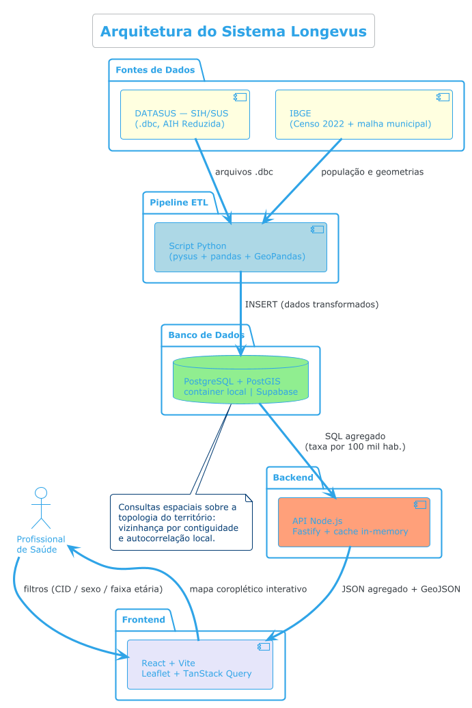
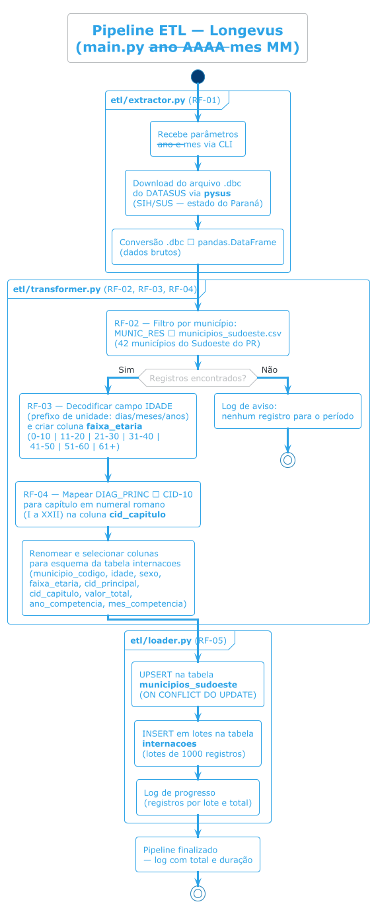
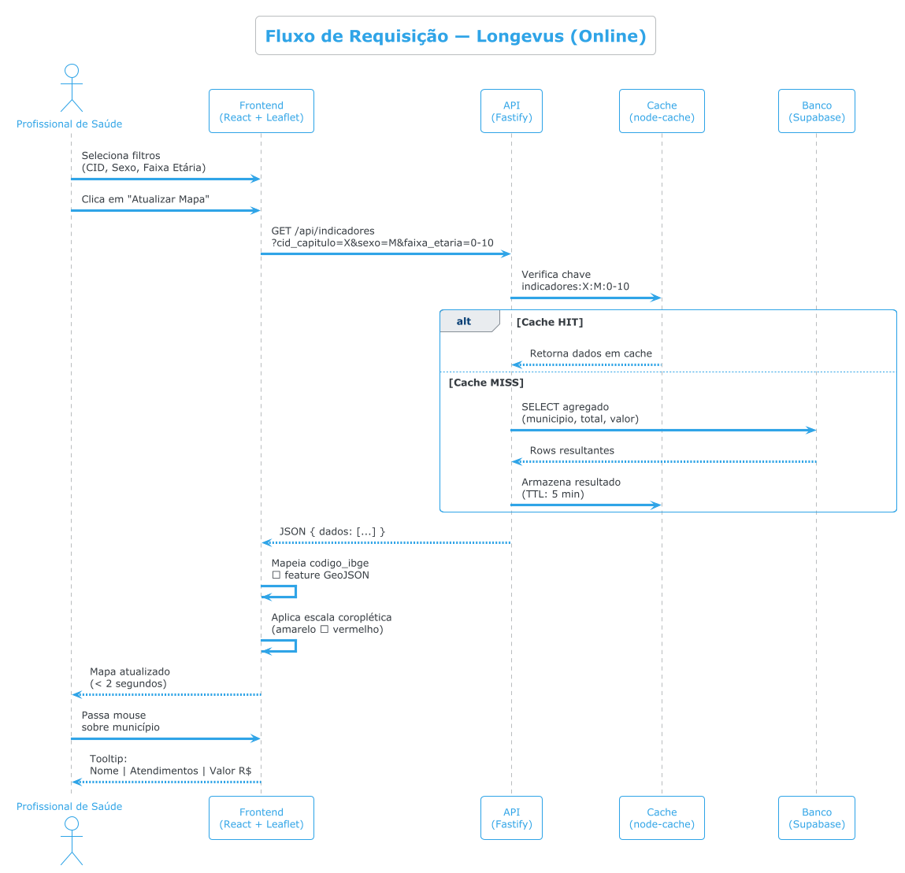
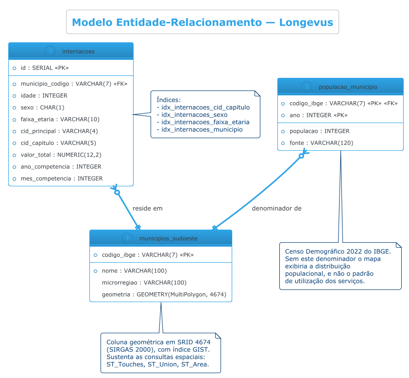
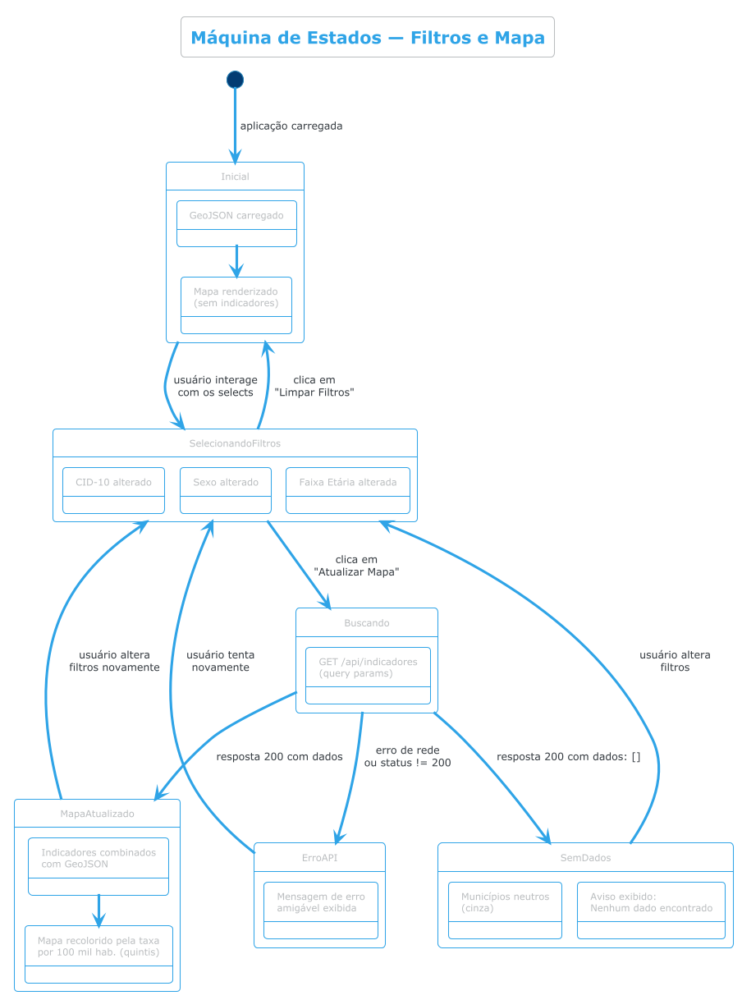
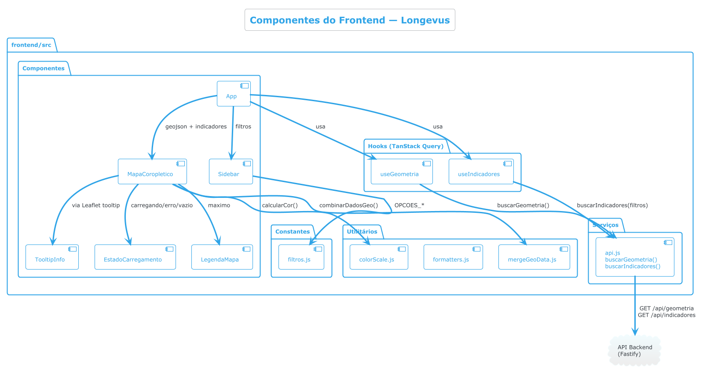
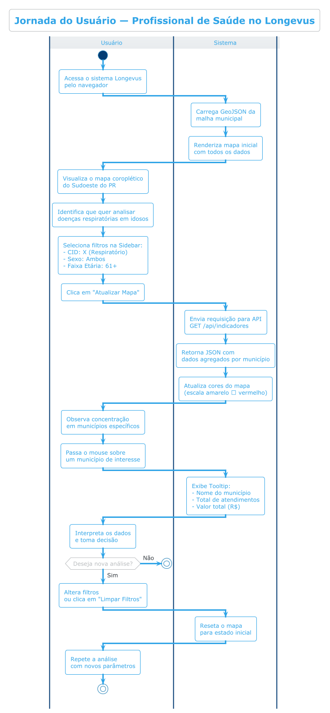
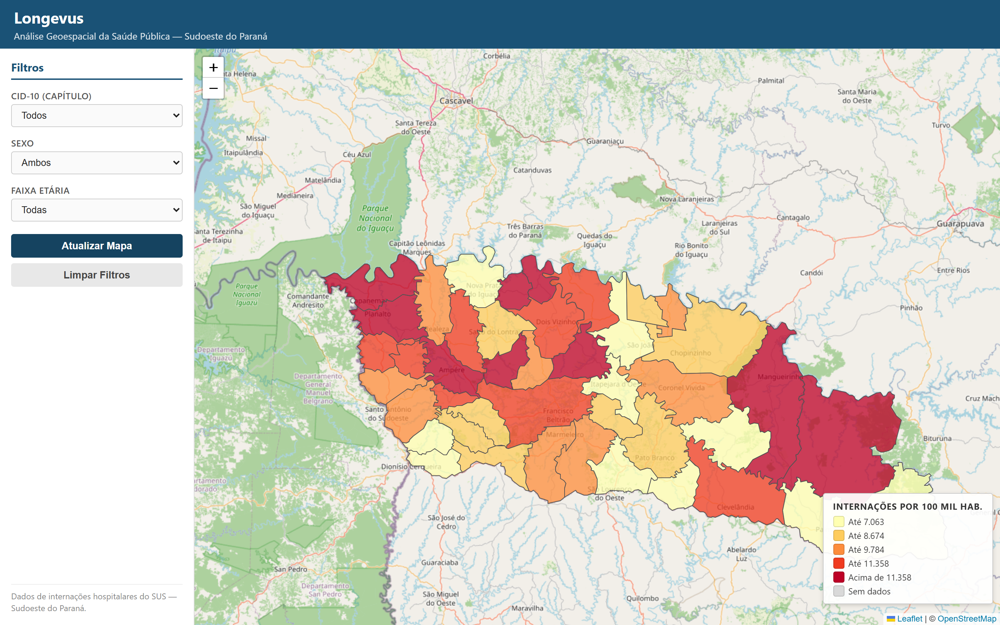
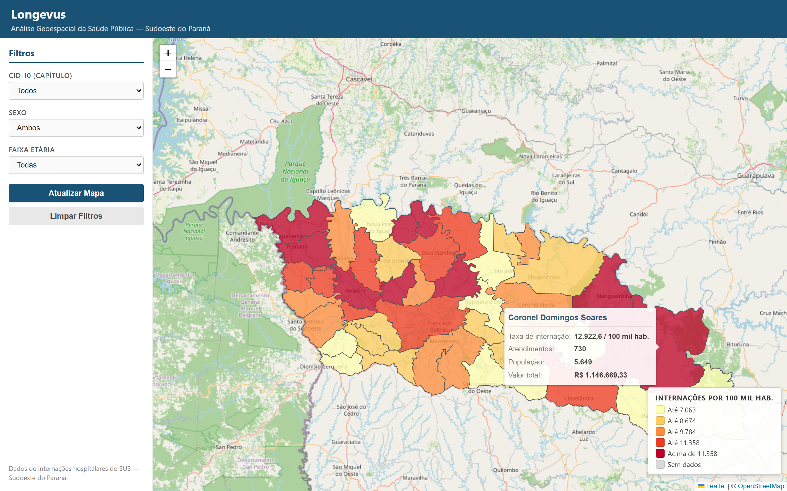

# ANÁLISE GEOESPACIAL DOS PADRÕES DE UTILIZAÇÃO DOS SERVIÇOS DE SAÚDE PÚBLICA NO SUDOESTE DO PARANÁ A PARTIR DE DADOS ABERTOS

**André Luiz Costa da Silva**

---

## Resumo

Este trabalho apresenta o desenvolvimento e a aplicação do Longevus, uma plataforma web de análise geoespacial construída sobre dados abertos do Sistema de Informações Hospitalares do SUS (SIH/SUS). A plataforma integra um pipeline de extração, transformação e carga em Python, um banco PostgreSQL com extensão PostGIS, uma API REST em Node.js e uma interface web com mapa coroplético interativo, filtrável por capítulo da CID-10, sexo e faixa etária. O desenvolvimento seguiu abordagem orientada a especificação (*Specification-Driven Development*), com requisitos funcionais e não funcionais formalizados antes da implementação e cenários de comportamento descritos em Gherkin. Foram processadas as doze competências de 2023 para os 42 municípios da área de abrangência da Associação dos Municípios do Sudoeste do Paraná: de 944.137 registros brutos do estado do Paraná, 61.814 correspondem a residentes do recorte, somando R$ 90.068.928,02 em valores de AIH. Os resultados mostram que a leitura territorial muda de forma substantiva quando as internações são normalizadas pela população residente: a correlação de postos entre o ranking absoluto e o ranking por taxa é de apenas 0,326, e Palmas cai da 4ª para a 34ª posição enquanto Boa Esperança do Iguaçu sobe da 37ª para a 5ª. As taxas variam de 5.476,3 a 13.313,2 internações por 100 mil habitantes. A análise de autocorrelação espacial executada em PostGIS indica que 32 dos 42 municípios (76,2%) integram aglomerados de municípios limítrofes com taxas do mesmo nível, contra os cerca de 50% esperados sob distribuição aleatória — ou seja, o padrão observado é territorial, e não disperso. Os dez requisitos não funcionais especificados foram medidos e atendidos, com latência p95 da API de 5,54 ms sob dez conexões concorrentes e repintura do mapa em 60,1 ms.

**Palavras-chave:** saúde pública; dados abertos; engenharia de software; análise geoespacial; SUS; PostGIS.

## Abstract

This work presents the development and application of Longevus, a web-based geospatial analysis platform built on open data from the Brazilian Hospital Information System (SIH/SUS). The platform integrates a Python extract-transform-load pipeline, a PostgreSQL database with the PostGIS extension, a Node.js REST API, and a web interface featuring an interactive choropleth map filterable by ICD-10 chapter, sex, and age group. Development followed a Specification-Driven Development approach, with functional and non-functional requirements formalized prior to implementation and behavioural scenarios written in Gherkin. All twelve monthly datasets of 2023 were processed for the 42 municipalities of the Southwest Paraná municipal association area: out of 944.137 raw records for the state of Paraná, 61.814 correspond to residents of the study area, totalling BRL 90.068.928,02 in hospital authorization values. Results show that the territorial reading changes substantially once admissions are normalized by resident population: the rank correlation between the absolute ranking and the rate-based ranking is only 0.326, with Palmas falling from 4th to 34th place while Boa Esperança do Iguaçu rises from 37th to 5th. Rates range from 5,476.3 to 13,313.2 admissions per 100,000 inhabitants. A spatial autocorrelation analysis executed in PostGIS indicates that 32 of the 42 municipalities (76.2%) belong to clusters of adjacent municipalities sharing the same rate level, against the roughly 50% expected under a random distribution — the observed pattern is therefore territorial rather than dispersed. All ten specified non-functional requirements were measured and met, with API p95 latency of 5.54 ms under ten concurrent connections and map repainting in 60.1 ms.

**Keywords:** public health; open data; software engineering; geospatial analysis; SUS; PostGIS.

---

## 1 Introdução

O Sistema Único de Saúde (SUS) é uma das principais políticas públicas brasileiras, destacando-se como caso de sucesso a nível global ao garantir acesso universal aos serviços de saúde (BRASIL, 1990). A grande quantidade de dados gerada diariamente pela interação entre usuários e serviços possibilita a realização de análises para compreensão do comportamento social relacionado ao uso dos serviços, além de apontar pontos de atenção para os municípios atuarem de maneira preventiva.

Esses dados são públicos e estão disponíveis, mas disponibilidade não é o mesmo que acessibilidade. Como argumenta Kitchin (2014), a abertura de dados governamentais só se converte em valor público quando acompanhada de infraestrutura capaz de transformar registros administrativos brutos em informação interpretável. No caso do SIH/SUS, os arquivos são distribuídos em formato `.dbc`, um formato comprimido proprietário do DATASUS, com dezenas de colunas codificadas e sem qualquer normalização por população — o que os torna, na prática, inacessíveis a quem não domina programação e o dicionário de dados do sistema.

Nesse contexto, a engenharia de software desempenha papel fundamental ao viabilizar a extração, o tratamento e a análise de grandes volumes de dados públicos, permitindo transformar dados brutos em informações relevantes para um público que geralmente tem baixa afinidade com bases de dados. A utilização de técnicas de análise geoespacial potencializa esse processo ao possibilitar a visualização territorial dos fenômenos estudados de maneira mais acessível.

Diante disso, este trabalho propõe a análise de dados abertos do SUS com foco no Sudoeste do Paraná, buscando identificar padrões de utilização dos serviços de saúde pública, o perfil dos usuários, os principais motivos de busca e os valores financeiros associados aos atendimentos.

Além do aspecto analítico, o projeto se insere no campo da engenharia de software por envolver levantamento de requisitos, definição arquitetural, modularização, tratamento de requisitos não funcionais e construção de uma solução orientada à manutenção e evolução. O trabalho não se restringe, portanto, ao processamento de dados: trata também da concepção de um sistema de software cujos atributos de qualidade foram especificados como metas mensuráveis e verificados por medição, e não apenas declarados.

### 1.1 Objetivo Geral

Desenvolver uma plataforma de análise geoespacial capaz de extrair, transformar, armazenar e visualizar dados públicos de internações hospitalares do SUS, permitindo a identificação de padrões territoriais de utilização dos serviços de saúde no Sudoeste do Paraná.

### 1.2 Objetivos Específicos

- Estruturar um pipeline ETL para obtenção e tratamento dos dados do SIH/SUS;
- Consolidar os dados em banco relacional com suporte geoespacial, empregando consultas espaciais sobre a topologia do território;
- Disponibilizar uma API para consulta agregada por município;
- Implementar uma interface web interativa com filtros por capítulo CID-10, sexo e faixa etária, com coloração normalizada pela população residente;
- Especificar requisitos não funcionais como metas mensuráveis e verificá-los por medição;
- Apoiar a interpretação dos dados por profissionais de saúde com baixa afinidade técnica.

### 1.3 Organização do Trabalho

A seção 2 apresenta o referencial teórico sobre dados abertos em saúde, análise geoespacial e as ferramentas existentes de consulta ao DATASUS. A seção 3 discute a fundamentação de engenharia de software adotada. A seção 4 descreve a metodologia, incluindo a classificação metodológica da pesquisa, a abordagem orientada a especificação e a implementação de cada camada. A seção 5 apresenta a jornada do usuário. A seção 6 reúne os resultados obtidos com o processamento das doze competências de 2023, a verificação dos requisitos não funcionais e a discussão dos achados. A seção 7 traz as considerações finais.

---

## 2 Saúde Pública, Dados Abertos e Análise Territorial

O estado atual da saúde pública está diretamente relacionado às condições sociais, econômicas e demográficas da população. O acesso aos serviços de saúde e os motivos de busca por atendimento refletem aspectos do comportamento social, alimentar e profissional, além da organização territorial.

A política de dados abertos no Brasil tem ampliado o acesso a informações governamentais, permitindo que pesquisadores utilizem bases públicas para análises diversas. No âmbito da saúde, o DATASUS disponibiliza dados administrativos e epidemiológicos que possibilitam estudos sobre o uso do SUS em diferentes regiões do país, com recortes por município de residência, sexo, idade e Classificação Internacional de Doenças (BRASIL, 2024).

A análise desses dados, quando associada a recortes geográficos e demográficos, contribui para a compreensão das desigualdades regionais e dos padrões de demanda por serviços de saúde específicos. Kitchin (2014) observa, contudo, que dados abertos tendem a beneficiar preferencialmente quem já dispõe de capacidade técnica para processá-los, de modo que a mediação tecnológica é parte da política de acesso, e não um detalhe de implementação.

### 2.1 O registro de internação: o que a AIH mede

A unidade de registro do SIH/SUS é a Autorização de Internação Hospitalar (AIH). Cada AIH corresponde a uma internação e carrega, entre outros campos, o município de residência do paciente, a idade, o sexo, o diagnóstico principal codificado segundo a CID-10 (ORGANIZAÇÃO MUNDIAL DA SAÚDE, 2008) e o valor total pago pelo SUS ao estabelecimento.

Duas propriedades desse registro condicionam a leitura dos resultados. A primeira é que o valor da AIH é o repasse calculado pela tabela de procedimentos do SUS, e não o custo real do atendimento; ele mede quanto o sistema pagou, não quanto o cuidado custou. A segunda é que o registro é administrativo, produzido para fins de faturamento, o que significa que a qualidade do preenchimento de campos como o diagnóstico principal varia entre estabelecimentos.

### 2.2 Autocorrelação espacial

Fenômenos distribuídos no território raramente se distribuem ao acaso. A formulação clássica desse princípio é a primeira lei da geografia de Tobler (1970), segundo a qual tudo se relaciona com tudo, mas coisas próximas se relacionam mais fortemente do que coisas distantes. Em análise de dados de saúde, isso implica que a taxa de internação de um município tende a se assemelhar à de seus vizinhos, seja por compartilharem perfil socioeconômico, seja por dependerem da mesma rede assistencial.

Anselin (1995) formalizou essa intuição em indicadores locais de associação espacial (LISA), que comparam o valor observado em cada unidade territorial com a média dos valores de suas unidades vizinhas, classificando cada uma em quatro situações: valor alto cercado de valores altos, valor baixo cercado de valores baixos — ambos configurando aglomerados — e as duas combinações discordantes, que caracterizam *outliers* espaciais. Este trabalho aplica essa lógica de classificação, com a mediana regional como referência de corte, para verificar se as taxas de internação do Sudoeste do Paraná formam blocos contíguos ou se distribuem de modo disperso.

### 2.3 Trabalhos Relacionados: o TabNet do DATASUS

A ferramenta de referência para consulta pública aos dados do SUS é o TabNet, tabulador *online* mantido pelo próprio DATASUS (BRASIL, 2024). O TabNet permite cruzar praticamente qualquer par de variáveis do SIH/SUS, cobre todo o território nacional e toda a série histórica disponível — cobertura que este trabalho não pretende igualar. Reconhecer essa amplitude é necessário para delimitar com honestidade o que o Longevus acrescenta.

As diferenças estão em três pontos. O primeiro é a **saída**: o TabNet produz tabelas de contagem, e a leitura territorial fica a cargo de quem consulta; o Longevus produz um mapa coroplético em que o padrão espacial é o próprio objeto de leitura. O segundo é a **normalização**: o TabNet tabula números absolutos, e obter uma taxa por 100 mil habitantes exige que o usuário busque o denominador populacional em outra base do IBGE e faça a divisão manualmente, município a município; no Longevus a taxa é o indicador que colore o mapa, calculada no banco a cada consulta. O terceiro é a **análise espacial**: o TabNet não conhece a topologia do território — não sabe quais municípios são limítrofes —, ao passo que a malha municipal armazenada em PostGIS permite consultar relações de vizinhança e avaliar aglomeração, o que a seção 6.4 apresenta.

Em resumo, o TabNet é uma ferramenta de tabulação de alcance nacional, e o Longevus é uma ferramenta de leitura territorial de alcance regional. Não são substitutos: o segundo responde a uma pergunta — onde, relativamente à população, se interna mais — que o primeiro deixa para o usuário resolver por conta própria.

---

## 3 Engenharia de Software Aplicada à Análise Geoespacial

A engenharia de software aplicada à análise de dados públicos envolve a definição de processos sistemáticos para extração, transformação, armazenamento e análise das informações. Neste trabalho, adotou-se um pipeline de engenharia de dados que integra banco de dados relacional, processamento analítico e visualização geoespacial.

O uso de sistemas de informações geográficas (SIG) possibilita a geração de mapas dinâmicos, os quais facilitam a interpretação dos dados e a identificação de padrões territoriais por parte dos profissionais de saúde. A aplicação de filtros por CID, sexo e faixa etária permite análises segmentadas, evidenciando diferentes comportamentos sociais no uso dos serviços de saúde.

Sob a ótica da engenharia de software, a solução exigiu a definição clara de responsabilidades entre componentes, a padronização de contratos de comunicação e a adoção de critérios de qualidade para garantir evolução sustentável. Como observam Bass, Clements e Kazman (2021), a arquitetura de um sistema é essencialmente o conjunto de decisões que condicionam seus atributos de qualidade: decisões como granularidade dos módulos, validação de entradas, desempenho das consultas e clareza da interface impactam diretamente a utilidade do produto final.

### 3.1 Arquitetura do Sistema

O sistema Longevus é composto por três camadas principais, conforme ilustrado no diagrama abaixo:

> 📄 Código-fonte: [`docs/diagrams/arquitetura.puml`](docs/diagrams/arquitetura.puml)

A separação em camadas garante que cada componente evolua de forma independente, facilitando a manutenção e a testabilidade do sistema. A regra de dependência é unidirecional: rotas dependem de serviços, serviços dependem de repositórios, repositórios dependem do driver de banco, e nenhuma camada interna conhece as externas. A seção 6.5 verifica empiricamente que essa regra não é violada em nenhum ponto do código.

### 3.2 Engenharia de Requisitos

O desenvolvimento do sistema foi orientado por requisitos funcionais e não funcionais formalizados antes da implementação, em documento versionado junto ao código (`spec/requirements.md`). Os requisitos funcionais descrevem as capacidades centrais da solução — extrair dados do SIH/SUS, filtrar municípios do recorte, agrupar registros por faixa etária e capítulo CID-10, expor endpoints de consulta e renderizar um mapa interativo com filtros. Os requisitos não funcionais estabelecem critérios de qualidade referentes a desempenho, leveza, manutenibilidade e usabilidade.

Uma decisão metodológica merece registro. Na primeira versão da especificação, os requisitos não funcionais estavam redigidos de forma qualitativa — "a renderização deve ser rápida", "o código deve seguir arquitetura em camadas". Como observa Sommerville (2019), requisitos não funcionais assim enunciados não são verificáveis, e um requisito que não pode ser verificado não distingue o sistema que o atende do que não o atende. A especificação foi então revista para que cada requisito não funcional declarasse três elementos: uma **métrica**, uma **meta numérica** e o **instrumento de medição**. Os dez requisitos resultantes, bem como suas medições, são apresentados na seção 6.5. A classificação dos atributos de qualidade seguiu, em linhas gerais, as categorias da norma ISO/IEC 25010 (2011) — desempenho, manutenibilidade, usabilidade e confiabilidade.

### 3.3 Qualidade de Software e Manutenibilidade

Entre os principais atributos de qualidade considerados no trabalho, destacam-se a modularidade, a manutenibilidade e a confiabilidade da interação entre componentes. A modularidade é observada na separação entre pipeline ETL, backend e frontend, permitindo que alterações em uma camada tenham impacto reduzido nas demais. A manutenibilidade é reforçada pela organização em rotas, serviços, repositórios e utilitários, o que facilita a localização de responsabilidades e a evolução incremental do código (PRESSMAN; MAXIM, 2016).

O projeto também contempla preocupações com desempenho e eficiência operacional. O uso de agregação no banco, cache in-memory e respostas enxutas em JSON reduz o custo de processamento e melhora o tempo de resposta percebido pelo usuário — efeito quantificado na seção 6.5. A definição explícita de contratos de entrada e saída na API reduz ambiguidades de integração, fortalecendo a confiabilidade da comunicação entre frontend e backend.

---

## 4 Metodologia

### 4.1 Classificação Metodológica

Quanto à natureza, esta é uma pesquisa **aplicada**: seu produto é um artefato de software destinado a uso concreto, e não a produção de conhecimento teórico geral. Quanto aos objetivos, é **exploratória e descritiva** — descreve o perfil das internações hospitalares do recorte e explora seus padrões territoriais, sem testar hipóteses causais. Quanto à abordagem do problema, é **quantitativa**, baseada em dados administrativos secundários. Quanto aos procedimentos técnicos, combina pesquisa bibliográfica com **pesquisa-desenvolvimento**, na qual a construção do artefato é simultaneamente método e resultado (GIL, 2017; WAZLAWICK, 2014).

O objeto empírico é a totalidade das internações hospitalares registradas no SIH/SUS cujo município de residência pertence ao recorte, nas doze competências de 2023. Não se trata de amostra: o estudo opera sobre o universo dos registros disponíveis para o período e o território, o que dispensa inferência amostral, mas não elimina as limitações de subnotificação e de qualidade do preenchimento discutidas na seção 6.8.

### 4.2 Desenvolvimento Orientado a Especificação

O desenvolvimento seguiu a abordagem de *Specification-Driven Development* (SDD): a especificação formal precede a implementação, a implementação é guiada pela especificação, e os testes são validados contra ela. Concretamente, isso significa que toda alteração de comportamento do sistema começa pela edição dos documentos em `spec/` — requisitos, contrato da API e modelo de dados — e só depois alcança o código.

Essa disciplina foi exercida mais de uma vez durante o trabalho. Quando se constatou que colorir o mapa pelo número absoluto de internações reproduziria a distribuição populacional em vez do padrão de utilização, a correção começou pela reescrita do requisito RF-11 na especificação, seguida da criação da tabela `populacao_municipio` no modelo de dados e só então da alteração do código de coloração. O mesmo ocorreu quando se identificou que os cortes da escala de cores deixavam níveis inteiros sem uso: o requisito RF-19 foi acrescentado antes da mudança do algoritmo.

O comportamento esperado da interface foi descrito em cenários **BDD** (*Behaviour-Driven Development*), escritos na linguagem Gherkin e mantidos em `spec/behaviors/` (NORTH, 2006; WYNNE; HELLESØY, 2012). Os cenários funcionam como especificação executável no sentido proposto por Adzic (2011): descrevem o comportamento em linguagem acessível a quem não programa e servem de referência direta para os testes automatizados. O cenário "Coloração normalizada pela população", por exemplo, é verificado por um teste que compara as cores atribuídas a Verê e a Pato Branco com os números reais de 2023 — se a coloração voltasse a se basear no valor absoluto, o teste falharia.

### 4.3 Recorte Territorial e Fontes de Dados

O estudo foi delimitado ao Sudoeste do Paraná. O recorte adotado é a área de abrangência da **Associação dos Municípios do Sudoeste do Paraná (AMSOP)**, composta por 42 municípios. Essa definição merece justificativa, porque a mesorregião Sudoeste Paranaense do IBGE reúne 37 municípios, e não 42.

Para tornar o critério verificável a partir de fonte oficial única, o recorte foi derivado da união de quatro microrregiões do IBGE: Capanema (8 municípios), Francisco Beltrão (19), Pato Branco (10) e Palmas (5). As três primeiras compõem a mesorregião Sudoeste Paranaense; a microrregião de Palmas pertence à mesorregião Centro-Sul Paranaense, mas integra a AMSOP e articula-se à mesma rede regional de serviços. O arquivo de referência dos 42 municípios é gerado programaticamente a partir da base de localidades do IBGE, de modo que os códigos municipais são reprodutíveis e conferíveis.

As três fontes de dados utilizadas são:

| Fonte | Uso | Referência |
|-------|-----|------------|
| SIH/SUS — AIH Reduzida, competências 01/2023 a 12/2023, Paraná | Numerador: internações, diagnóstico, sexo, idade, valor | BRASIL (2024) |
| IBGE — Censo Demográfico 2022, população residente | Denominador das taxas por 100 mil habitantes | IBGE (2023) |
| IBGE — malha municipal digital | Geometria dos 42 municípios | IBGE (2023) |

O Censo 2022 foi adotado como denominador porque a série de estimativas populacionais do IBGE não cobre 2023 — o Censo a substituiu naquele intervalo —, de modo que o ano imediatamente anterior à competência analisada é o denominador disponível mais próximo.

### 4.4 Pipeline de Dados (ETL)

Os dados foram obtidos a partir dos arquivos reduzidos do SIH/SUS referentes ao estado do Paraná. Após a extração, passaram por etapas de limpeza e transformação em Python, incluindo a decodificação da idade, a criação de faixas etárias e o agrupamento dos códigos CID-10 por capítulos. Em seguida, foram carregados em banco PostgreSQL com extensão PostGIS.

O fluxo completo do pipeline ETL é descrito no diagrama a seguir:

> 📄 Código-fonte: [`docs/diagrams/fluxo_etl.puml`](docs/diagrams/fluxo_etl.puml)

#### 4.4.1 Transformações Aplicadas

Três transformações concentram a complexidade do pipeline e, por isso, receberam cobertura de testes:

**Decodificação da idade.** O SIH/SUS não armazena a idade em anos diretamente: o campo `IDADE` é acompanhado de um código de unidade (`COD_IDADE`) que indica se o número expressa dias, meses ou anos. Um recém-nascido de vinte dias e uma pessoa de vinte anos aparecem com o mesmo valor no campo numérico, distinguidos apenas pela unidade. A rotina de decodificação converte tudo para anos completos, tratando os casos de borda.

**Classificação em faixas etárias.** As idades são agrupadas em sete faixas (0-10, 11-20, 21-30, 31-40, 41-50, 51-60 e 61+), com atenção às bordas exatas — uma pessoa de 10 anos pertence à primeira faixa, uma de 11 à segunda.

**Mapeamento CID-10 para capítulo.** O código de diagnóstico principal é reduzido ao capítulo correspondente da CID-10, identificado por numeral romano de I a XXII (ORGANIZAÇÃO MUNDIAL DA SAÚDE, 2008). O agrupamento por capítulo é o que torna o filtro utilizável: são 22 opções, e não milhares de códigos.

#### 4.4.2 Registro do Funil de Processamento

O pipeline contabiliza cada registro descartado e o motivo do descarte — idade indecifrável, sexo inválido, CID desconhecido ou valor inválido —, produzindo um funil completo de brutos até carregados (RF-16). Esse registro é o que permite auditar a diferença entre o volume da fonte e o volume analisado, apresentada na seção 6.1.

### 4.5 API Backend (Longevus API)

A API foi implementada em Node.js 20 com o framework Fastify.

#### 4.5.1 Endpoints Implementados

| Endpoint | Função |
|----------|--------|
| `GET /api/indicadores` | Agregação por município, com filtros opcionais de capítulo CID-10, sexo e faixa etária |
| `GET /api/geometria` | Malha territorial dos 42 municípios em GeoJSON |
| `GET /health` | Verificação de disponibilidade |

O endpoint de indicadores retorna, para cada município, o total de atendimentos, o valor total, a população residente e a taxa por 100 mil habitantes. A agregação parte da tabela de municípios com junção à esquerda sobre as internações, de modo que municípios sem registros no filtro corrente retornem com contagem zero em vez de desaparecerem do resultado — condição para que o mapa renderize os 42 municípios em qualquer combinação de filtros.

#### 4.5.2 Organização em Camadas

A API está organizada em rotas, serviços, repositórios e utilitários. Cada camada tem responsabilidade definida: a rota recebe a requisição e valida os parâmetros, o serviço aplica regras de negócio e cache, o repositório acessa os dados e o utilitário estrutura a resposta.

#### 4.5.3 Cache in-memory

O endpoint de indicadores é servido por cache in-memory com chave derivada da combinação de filtros e tempo de vida configurável. Como o conjunto de combinações possíveis de filtros é pequeno e os dados de uma competência fechada não mudam, o cache elimina consultas repetidas ao banco durante a exploração interativa. O efeito é quantificado na seção 6.5.

#### 4.5.4 Fluxo de uma Requisição

> 📄 Código-fonte: [`docs/diagrams/sequencia.puml`](docs/diagrams/sequencia.puml)

#### 4.5.5 Contratos, Validação e Coesão

A API exerce papel de fronteira contratual entre os componentes do sistema. Os parâmetros `cid_capitulo`, `sexo` e `faixa_etaria` são validados antes do processamento, reduzindo a propagação de erros para as camadas internas e aumentando a previsibilidade das respostas. A padronização do formato de saída simplifica a integração com o frontend, tornando a comunicação mais estável e de menor acoplamento.

O sistema opera em dois ambientes equivalentes: um container PostgreSQL/PostGIS local, usado nas medições e nas consultas espaciais, e o Supabase, na implantação em nuvem. O repositório seleciona o driver conforme a configuração de ambiente, sem que serviços e rotas tomem conhecimento dessa escolha — aplicação direta do princípio de que camadas internas não devem depender de detalhes de infraestrutura.

### 4.6 Modelo de Dados

O modelo é composto por três tabelas e uma coluna geométrica, conforme o diagrama de entidade-relacionamento:

> 📄 Código-fonte: [`docs/diagrams/er.puml`](docs/diagrams/er.puml)

**`internacoes`** é a tabela-fato, com uma linha por AIH: município de residência, idade, sexo, faixa etária, CID principal, capítulo CID-10, valor total e competência. Índices sobre capítulo, sexo, faixa etária e município sustentam os filtros da API.

**`municipios_sudoeste`** é a tabela de referência do recorte, com código IBGE, nome, microrregião e a coluna geométrica que armazena o polígono municipal em SRID 4674 (SIRGAS 2000), com índice GIST.

**`populacao_municipio`** guarda o denominador das taxas, com chave composta por município e ano e um campo de fonte que registra a procedência da contagem. Sem essa tabela, o mapa exibiria a distribuição populacional em vez do padrão de utilização dos serviços.

A separação entre fato, referência territorial e denominador populacional permite atualizar cada dimensão independentemente — acrescentar uma nova competência de internações não exige tocar na malha nem na população.

### 4.7 Consultas Espaciais

O armazenamento da malha municipal em PostGIS não é decorativo: ele viabiliza consultas sobre a **topologia** do território, e não apenas sobre atributos das tabelas (OBE; HSU, 2021). Três consultas foram implementadas:

1. **Matriz de vizinhança por contiguidade.** O predicado `ST_Touches` é verdadeiro quando dois polígonos compartilham fronteira sem sobreposição de interiores — exatamente a definição de municípios limítrofes. O índice GIST sobre a coluna geométrica sustenta o predicado.
2. **Métricas territoriais do recorte.** `ST_Union` dissolve os 42 polígonos em uma única geometria, sobre a qual `ST_Area` e `ST_Perimeter`, com projeção geográfica, produzem área e perímetro em unidades métricas.
3. **Autocorrelação espacial local.** Para cada município, a consulta compara sua taxa de internação com a média das taxas dos municípios limítrofes, classificando o par segundo a lógica dos indicadores LISA (ANSELIN, 1995), com a mediana regional como corte.

É a terceira consulta que responde à pergunta analítica central da seção 6.4: as taxas altas formam blocos contíguos ou se espalham ao acaso?

### 4.8 Interface Web (Frontend)

A interface foi implementada como *Single Page Application* em React 18 com Vite.

#### 4.8.1 React e Vite

O React foi escolhido por sua abordagem declarativa: a interface é descrita como função dos dados, e o framework atualiza o DOM quando os dados mudam. O Vite oferece servidor de desenvolvimento com *Hot Module Replacement* e build otimizado.

#### 4.8.2 Leaflet e Mapa Coroplético

A geometria retornada por `GET /api/geometria` é renderizada com Leaflet, através da camada `react-leaflet`, como uma camada GeoJSON de estilo dinâmico. Cada município recebe uma cor da escala sequencial amarelo → vermelho de cinco níveis, do `#ffffb2` ao `#bd0026` — escala derivada dos esquemas sequenciais do ColorBrewer, construídos para preservar a ordenação perceptual dos níveis (HARROWER; BREWER, 2003). Municípios sem taxa calculável recebem cinza neutro.

Duas decisões de projeto merecem destaque, porque ambas corrigem leituras enganosas do mapa.

A primeira é **o que a cor representa**. A coloração usa a taxa de internações por 100 mil habitantes, e não o número absoluto de atendimentos (RF-11). Colorir pelo absoluto faria o mapa reproduzir a distribuição populacional da região: Francisco Beltrão e Pato Branco apareceriam sempre no extremo da escala por serem os municípios mais populosos, independentemente do padrão de utilização dos serviços. O número absoluto permanece visível no tooltip, porque os dois números juntos é que tornam a leitura interpretável.

A segunda é **onde a escala corta**. Os cortes são os quintis da distribuição observada no conjunto filtrado (RF-19). Cortes proporcionais ao valor máximo — 20%, 40%, 60% e 80% dele — só discriminam quando a distribuição parte de perto de zero, e não é o caso aqui: em 2023 a menor taxa municipal já correspondia a 41% da maior, de modo que os dois níveis mais claros da escala nunca eram usados e quase toda a região aparecia em tons de vermelho. Com cortes quantílicos, cada nível recebe aproximadamente um quinto dos municípios e o contraste interno ao recorte volta a ser visível.

O tooltip exibe, ao passar o mouse sobre um município, o nome, a taxa por 100 mil habitantes, o total de atendimentos, a população residente e o valor total em reais (RF-12).

#### 4.8.3 TanStack Query

O TanStack Query gerencia o ciclo de vida das requisições HTTP. O hook `useGeometria` carrega o GeoJSON ao iniciar a aplicação, com cache no cliente. O hook `useIndicadores` é habilitado somente após o usuário clicar em "Atualizar Mapa", evitando requisições desnecessárias durante a seleção dos filtros. A biblioteca gerencia os estados de carregamento, erro e sucesso, repassados aos componentes visuais de feedback.

#### 4.8.4 Fluxo de Interação

> 📄 Código-fonte: [`docs/diagrams/estado_filtros.puml`](docs/diagrams/estado_filtros.puml)

A estrutura de componentes do frontend é apresentada no diagrama a seguir:

> 📄 Código-fonte: [`docs/diagrams/componentes_frontend.puml`](docs/diagrams/componentes_frontend.puml)

#### 4.8.5 Usabilidade e Organização da Interface

A interface foi concebida considerando princípios de usabilidade aplicados à engenharia de software — simplicidade de navegação, redução de carga cognitiva e visibilidade do estado do sistema (NIELSEN, 1993). A presença de filtros explícitos, botão de atualização e mensagens de carregamento ou erro contribui para que o usuário compreenda o comportamento da aplicação sem conhecimento técnico sobre bancos de dados ou APIs.

A organização interna do frontend separa componentes visuais, hooks de acesso a dados, constantes e utilitários, o que favorece manutenção futura e permite ajustar regras de negócio, visualização ou integração sem reescrever a aplicação.

### 4.9 Estratégia de Verificação

A verificação do sistema combina duas frentes.

A primeira é o **teste automatizado** das transformações mais críticas. O módulo de transformação do pipeline concentra as regras cuja falha corromperia silenciosamente todos os resultados — decodificação de idade, faixas etárias e mapeamento CID-10 —, e por isso recebeu bateria de testes unitários com foco em casos de borda. No frontend, os utilitários de escala de cores e de combinação entre geometria e indicadores são testados contra os cenários Gherkin, com os números reais de 2023, de modo que uma regressão na regra de normalização quebre a suíte.

A segunda é a **medição dos requisitos não funcionais**. Cada requisito com meta numérica tem um instrumento correspondente, executável por linha de comando: um script de carga mede a latência da API, um script dirigido por navegador mede o tempo de repintura do mapa, e as demais métricas são extraídas do repositório e dos relatórios de cobertura. Os resultados são consolidados automaticamente na tabela de verificação apresentada na seção 6.5.

---

## 5 Jornada do Usuário

O sistema foi projetado para profissionais de saúde com baixa afinidade técnica. A jornada completa do usuário dentro da plataforma é apresentada abaixo:

> 📄 Código-fonte: [`docs/diagrams/jornada_usuario.puml`](docs/diagrams/jornada_usuario.puml)

Do carregamento da página até a obtenção de um mapa filtrado, o percurso exige no máximo quatro interações: a seleção de cada um dos três filtros e o clique no botão de atualização. Todos os filtros são opcionais, de modo que um único clique produz o mapa geral da região.

---

## 6 Resultados e Discussão

Esta seção apresenta os resultados obtidos com o processamento das doze competências de 2023. Os números foram extraídos por scripts versionados no repositório, cujas saídas estão em `docs/resultados/`.

### 6.1 Caracterização da Base Processada

O pipeline foi executado para as competências de janeiro a dezembro de 2023, com a AIH Reduzida do estado do Paraná como entrada. A tabela abaixo apresenta o funil de processamento.

| Etapa | Registros | % dos brutos |
|-------|-----------|--------------|
| Registros brutos (Paraná, grupo RD) | 944.137 | 100,00% |
| Descartados por residência fora do recorte | 882.323 | 93,45% |
| Descartados por inconsistência | 0 | 0,00% |
| **Registros carregados** | **61.814** | **6,55%** |

Dois pontos merecem comentário. O primeiro é a proporção: os 42 municípios do recorte respondem por 6,55% das internações do estado, o que é coerente com sua participação populacional. O segundo é a ausência de descartes por inconsistência. Nenhum dos quatro critérios — idade indecifrável, sexo inválido, CID desconhecido, valor inválido — eliminou registro algum nas doze competências. Isso não significa que a base seja isenta de problemas, e sim que os campos efetivamente utilizados por este trabalho vêm preenchidos e dentro dos domínios esperados. Erros de classificação diagnóstica, que nenhum desses critérios detecta, permanecem possíveis.

O perfil geral da base processada é o seguinte:

| Indicador | Valor |
|-----------|-------|
| Internações analisadas | 61.814 |
| Municípios do recorte | 42 |
| População residente (Censo IBGE 2022) | 662.679 |
| Taxa geral de internação | 9.327,9 por 100 mil habitantes |
| Valor total das AIH | R$ 90.068.928,02 |
| Valor médio por internação | R$ 1.457,10 |
| Idade média | 44,7 anos |
| Período | janeiro a dezembro de 2023 |

O processamento completo das doze competências — download, transformação e consolidação — levou 110,4 segundos, e a carga no banco, 15,0 segundos.

### 6.2 Perfil das Internações

#### 6.2.1 Capítulos CID-10 mais frequentes

| # | Capítulo | Descrição | Internações | % | Valor total | Valor médio |
|---|----------|-----------|-------------|---|-------------|-------------|
| 1 | XV | Gravidez, parto e puerpério | 8.596 | 13,91% | R$ 5.158.658,39 | R$ 600,12 |
| 2 | X | Doenças do aparelho respiratório | 7.522 | 12,17% | R$ 7.443.926,58 | R$ 989,62 |
| 3 | II | Neoplasias (tumores) | 7.165 | 11,59% | R$ 11.786.981,62 | R$ 1.645,08 |
| 4 | XIX | Lesões, envenenamentos e causas externas | 7.064 | 11,43% | R$ 9.434.510,83 | R$ 1.335,58 |
| 5 | XI | Doenças do aparelho digestivo | 6.039 | 9,77% | R$ 7.113.718,38 | R$ 1.177,96 |
| 6 | IX | Doenças do aparelho circulatório | 5.864 | 9,49% | R$ 17.952.654,79 | R$ 3.061,50 |
| 7 | I | Doenças infecciosas e parasitárias | 3.957 | 6,40% | R$ 8.121.802,34 | R$ 2.052,52 |
| 8 | XIV | Doenças do aparelho geniturinário | 3.696 | 5,98% | R$ 4.019.262,00 | R$ 1.087,46 |
| 9 | XIII | Doenças do sistema osteomuscular e conjuntivo | 1.900 | 3,07% | R$ 4.419.505,96 | R$ 2.326,06 |
| 10 | XII | Doenças da pele e do tecido subcutâneo | 1.673 | 2,71% | R$ 518.107,14 | R$ 309,69 |

Os dez capítulos concentram 86,51% das internações.

A tabela evidencia que frequência e custo não caminham juntos. O capítulo XV lidera em número de internações, mas com o menor valor médio da lista (R$ 600,12) — partos são frequentes e comparativamente baratos pela tabela SUS. O capítulo IX, das doenças circulatórias, ocupa a sexta posição em frequência e a **primeira em valor total** (R$ 17,95 milhões), com valor médio de R$ 3.061,50, cinco vezes o do capítulo XV. Uma leitura orientada apenas pela contagem de internações subestimaria o peso das doenças circulatórias na despesa regional.

#### 6.2.2 Distribuição por faixa etária e sexo

| Faixa etária | Feminino | Masculino | Total | % do total |
|--------------|----------|-----------|-------|------------|
| 0-10 | 3.058 | 4.214 | 7.272 | 11,76% |
| 11-20 | 2.823 | 1.624 | 4.447 | 7,19% |
| 21-30 | 6.436 | 2.310 | 8.746 | 14,15% |
| 31-40 | 4.706 | 2.431 | 7.137 | 11,55% |
| 41-50 | 3.437 | 2.822 | 6.259 | 10,13% |
| 51-60 | 3.786 | 4.111 | 7.897 | 12,78% |
| 61+ | 9.700 | 10.356 | 20.056 | 32,45% |
| **Total** | **33.946** | **27.868** | **61.814** | **100,00%** |

A distribuição etária tem forma de U assimétrico. Quase um terço das internações (32,45%) concentra-se na população de 61 anos ou mais, faixa em que a diferença entre sexos praticamente desaparece. O segundo pico está entre 21 e 30 anos, com predomínio feminino acentuado — 6.436 contra 2.310 —, consistente com o peso do capítulo XV no total. Nas faixas mais jovens e a partir dos 51 anos, o predomínio se inverte e passa a ser masculino.

### 6.3 Distribuição Territorial: Absoluto e Taxa

Este é o resultado central do trabalho. As duas tabelas abaixo ordenam os municípios pelos dois critérios e registram, em cada caso, a posição no outro ranking.

**Por número absoluto de internações:**

| # | Município | População | Internações | Taxa/100 mil | Posição na taxa | Variação |
|---|-----------|-----------|-------------|--------------|-----------------|----------|
| 1 | Francisco Beltrão | 96.666 | 9.730 | 10.065,6 | 14º | -13 |
| 2 | Pato Branco | 91.836 | 7.895 | 8.596,8 | 27º | -25 |
| 3 | Dois Vizinhos | 44.869 | 4.959 | 11.052,2 | 10º | -7 |
| 4 | Palmas | 48.247 | 3.352 | 6.947,6 | 34º | -30 |
| 5 | Ampére | 19.620 | 2.463 | 12.553,5 | 4º | +1 |
| 6 | Capanema | 20.481 | 2.402 | 11.727,9 | 7º | -1 |
| 7 | Santo Antônio do Sudoeste | 23.673 | 2.315 | 9.779,1 | 18º | -11 |
| 8 | Coronel Vivida | 23.331 | 2.032 | 8.709,4 | 25º | -17 |
| 9 | Mangueirinha | 16.603 | 1.938 | 11.672,6 | 8º | +1 |
| 10 | Planalto | 14.374 | 1.873 | 13.030,5 | 2º | +8 |

**Por taxa de internação por 100 mil habitantes:**

| # | Município | População | Internações | Taxa/100 mil | Posição no absoluto | Variação |
|---|-----------|-----------|-------------|--------------|---------------------|----------|
| 1 | Verê | 7.932 | 1.056 | 13.313,2 | 17º | +16 |
| 2 | Planalto | 14.374 | 1.873 | 13.030,5 | 10º | +8 |
| 3 | Coronel Domingos Soares | 5.649 | 730 | 12.922,6 | 21º | +18 |
| 4 | Ampére | 19.620 | 2.463 | 12.553,5 | 5º | +1 |
| 5 | Boa Esperança do Iguaçu | 2.455 | 305 | 12.423,6 | 37º | +32 |
| 6 | Cruzeiro do Iguaçu | 4.133 | 495 | 11.976,8 | 31º | +25 |
| 7 | Capanema | 20.481 | 2.402 | 11.727,9 | 6º | -1 |
| 8 | Mangueirinha | 16.603 | 1.938 | 11.672,6 | 9º | +1 |
| 9 | Nova Esperança do Sudoeste | 5.597 | 640 | 11.434,7 | 25º | +16 |
| 10 | Dois Vizinhos | 44.869 | 4.959 | 11.052,2 | 3º | -7 |

A comparação entre as duas tabelas é, por si só, um resultado. A correlação de postos de Spearman entre os dois rankings é de apenas **0,326** — os dois critérios produzem ordenações substancialmente diferentes do mesmo território. Palmas ocupa a 4ª posição em número absoluto e a 34ª em taxa; Boa Esperança do Iguaçu faz o percurso inverso, da 37ª à 5ª. Francisco Beltrão e Pato Branco, os dois maiores municípios, lideram o absoluto e ocupam a 14ª e a 27ª posições em taxa.

Isso confirma empiricamente a preocupação que orientou o RF-11: um mapa colorido pelo número absoluto de internações estaria, em grande medida, exibindo o mapa da população. A amplitude das taxas vai de 5.476,3 (Itapejara d'Oeste) a 13.313,2 (Verê) internações por 100 mil habitantes, razão de 2,4 entre os extremos — variação relevante que o valor absoluto oculta.

A figura abaixo apresenta o mapa coroplético resultante, sem filtros aplicados, com os cortes quantílicos em 7.063, 8.674, 9.784 e 11.358 internações por 100 mil habitantes:

E o tooltip exibido ao passar o mouse sobre um município, com a taxa acompanhada do número absoluto, da população e do valor total:

### 6.4 Autocorrelação Espacial

As consultas espaciais em PostGIS caracterizam o recorte e avaliam se as taxas se distribuem de forma aleatória pelo território.

| Indicador | Valor | Consulta |
|-----------|-------|----------|
| Municípios com geometria | 42 | — |
| Área total do recorte | 17.029,9 km² | `ST_Area(ST_Union(geometria)::geography)` |
| Perímetro do recorte | 916,7 km | `ST_Perimeter(ST_Union(geometria)::geography)` |
| Pares de municípios limítrofes | 196 | `ST_Touches` |
| Média de vizinhos por município | 4,7 | `ST_Touches` |

A classificação de cada município conforme sua taxa e a média das taxas de seus vizinhos, segundo a lógica LISA (ANSELIN, 1995), produziu o seguinte quadro:

| Classificação | Municípios | % | Interpretação |
|---------------|------------|---|---------------|
| `alta-alta` | 17 | 40,5% | Taxa alta cercada de taxas altas (aglomerado) |
| `baixa-baixa` | 15 | 35,7% | Taxa baixa cercada de taxas baixas (aglomerado) |
| `alta-baixa` | 4 | 9,5% | Taxa alta entre vizinhos de taxa baixa (*outlier*) |
| `baixa-alta` | 6 | 14,3% | Taxa baixa cercada de taxas altas (*outlier*) |

**Trinta e dois dos 42 municípios (76,2%) estão em aglomerados**, isto é, têm taxa do mesmo lado da mediana regional que a média de seus vizinhos. Sob distribuição aleatória, o esperado seria algo próximo de 50%. O padrão de utilização dos serviços hospitalares no Sudoeste do Paraná é, portanto, territorialmente estruturado: municípios limítrofes tendem a compartilhar o mesmo patamar de taxa, o que é coerente com a primeira lei da geografia (TOBLER, 1970) e sugere que os determinantes atuam em escala sub-regional, e não municipal isolada.

Vale notar que os dez municípios classificados como *outliers* espaciais são candidatos naturais a investigação: uma taxa alta cercada de taxas baixas — caso de Verê, o município de maior taxa do recorte — indica um fenômeno local que a média regional não explica.

Este é também o ponto em que se justifica a exigência de banco com extensão espacial declarada nos objetivos específicos. As três consultas desta seção operam sobre relações geométricas entre polígonos — quais municípios se tocam, qual a área da união das geometrias —, e não sobre atributos das tabelas. Nenhuma delas é expressável em SQL relacional puro.

### 6.5 Verificação dos Requisitos Não Funcionais

Cada requisito não funcional foi medido com o instrumento declarado na especificação. As medições foram tomadas contra o ambiente local — PostgreSQL 16 com PostGIS 3.4 em container, API Fastify em Node.js 20 — com a base de 2023 carregada.

| ID | Requisito | Métrica | Meta | Medido | Atendido |
|----|-----------|---------|------|--------|----------|
| RNF-01 | Desempenho da API | Latência p95, 10 conexões / 20 s, cache quente | ≤ 500 ms | 5,54 ms | sim |
| RNF-02 | Desempenho a frio | Latência da primeira resposta após reinício da API | ≤ 2.000 ms | 211,1 ms | sim |
| RNF-03 | Renderização do mapa | Clique em "Atualizar Mapa" até o fim da repintura | ≤ 2.000 ms | 60,1 ms | sim |
| RNF-04 | Leveza da malha | Tamanho do GeoJSON servido | ≤ 500 KB | 73,1 KB | sim |
| RNF-05 | Leveza do payload | Tamanho e cardinalidade da resposta de indicadores | ≤ 50 KB e 42 linhas | 4,8 KB, 42 linhas | sim |
| RNF-06 | Corretude do pipeline | Cobertura de linhas do módulo de transformação | ≥ 90% | 100% | sim |
| RNF-07 | Reprodutibilidade | Tempo do pipeline para as 12 competências | ≤ 30 min, sem passo manual | 110,4 s | sim |
| RNF-08 | Manutenibilidade | Importações que invertem a ordem entre camadas | Zero violações | 0 | sim |
| RNF-09 | Disponibilidade | Requisições com erro durante a carga sustentada | Zero erros | 0 em 77.673 | sim |
| RNF-10 | Usabilidade | Interações até um mapa filtrado | ≤ 4 | 4 | sim |

A distribuição da latência sob carga, com dez conexões concorrentes em laço fechado por vinte segundos, foi a seguinte:

| Estatística | Valor |
|-------------|-------|
| Requisições completadas | 77.673 |
| Vazão | 3.883,7 req/s |
| Latência média | 2,57 ms |
| p50 | 2,01 ms |
| p95 | 5,54 ms |
| p99 | 8,16 ms |
| Máxima | 36,92 ms |
| Erros | 0 |

A diferença entre a primeira resposta (211,1 ms, que atravessa o banco) e a mediana sob carga (2,01 ms, servida do cache in-memory) isola o efeito do cache: uma redução de aproximadamente **105 vezes** no tempo de resposta. Esse número justifica a decisão arquitetural descrita na seção 4.5.3, que antes figurava no trabalho apenas como afirmação qualitativa.

O tempo de repintura do mapa foi medido em sete repinturas sucessivas, alternando o filtro de capítulo CID-10 para garantir dados distintos a cada iteração. O relógio parte do clique e para no primeiro quadro renderizado após a última alteração do painel de sobreposição do Leaflet, de modo que o intervalo cobre a requisição à API, a recombinação com a geometria e a repintura dos 42 polígonos. A mediana foi de 60,1 ms.

### 6.6 Verificação por Testes Automatizados

A suíte de testes reúne 116 casos: 90 no pipeline e 26 no frontend.

No pipeline, os testes cobrem integralmente o módulo de transformação (100% das 128 linhas), com ênfase nos casos de borda que a seção 4.4.1 identificou como críticos: a decodificação de idade em dias, meses e anos, incluindo recém-nascidos e idades acima de 100 anos; as bordas exatas das faixas etárias; e o mapeamento de um código representativo por capítulo da CID-10, além de códigos inválidos.

No frontend, os testes verificam os utilitários de escala e de combinação entre geometria e indicadores, amarrados aos cenários Gherkin da especificação. O cenário "Coloração normalizada pela população" é verificado com os números reais de 2023: Pato Branco tem 7,5 vezes mais internações que Verê em valor absoluto e, ainda assim, taxa menor, de modo que o teste falha se a coloração voltar a se basear no absoluto. O cenário "Cortes da escala por quintis da distribuição" verifica que os 42 municípios se distribuem entre os cinco níveis da escala sem que nenhum nível fique vazio.

Três defeitos foram identificados durante essa etapa de verificação, todos corrigidos:

1. A API não emitia cabeçalhos CORS, o que impedia o frontend, servido de outra origem, de consumir qualquer endpoint.
2. A camada GeoJSON não era recriada quando novos indicadores chegavam, porque a chave de remontagem era incrementada em um efeito executado após a renderização — o resultado era um mapa permanentemente cinza, com legenda já preenchida.
3. Os cortes da escala de cores, proporcionais ao valor máximo, deixavam dois dos cinco níveis sem uso, conforme discutido na seção 4.8.2.

O registro desses defeitos é deliberado: os dois primeiros só apareceram porque a verificação foi feita sobre o sistema em execução, e não apenas sobre o código. É um argumento a favor de medir o que se especifica.

### 6.7 Discussão

Os resultados sustentam três afirmações.

A primeira é que a **normalização pela população muda a leitura do território**, e não marginalmente: com correlação de postos de 0,326 entre os dois critérios, um gestor que priorizasse municípios pelo número absoluto de internações e outro que os priorizasse pela taxa chegariam a listas quase independentes. A escolha do indicador não é detalhe de visualização, é decisão analítica com consequência prática.

A segunda é que o **padrão observado é territorial**. Com 76,2% dos municípios em aglomerados de vizinhança, as taxas altas e baixas não se espalham ao acaso pelo recorte. Isso reorienta a pergunta que os dados suscitam: em vez de perguntar por que um município se destaca, cabe perguntar o que caracteriza as sub-regiões que se destacam em bloco.

A terceira é que **atributos de qualidade especificados como metas mensuráveis são verificáveis a custo baixo**. Os dez requisitos não funcionais foram medidos por scripts que executam em poucos minutos e podem ser reexecutados a cada alteração. A diferença entre a versão inicial da especificação e a atual não está no sistema — está na possibilidade de afirmar, com número, que ele atende ao que promete.

Cabe uma ressalva interpretativa importante. Taxa alta de internação não é sinônimo de pior saúde nem de melhor acesso: pode indicar maior morbidade, maior oferta de leitos, maior facilidade de acesso à rede hospitalar ou fragilidade da atenção primária, que deixa de evitar internações potencialmente evitáveis (ALFRADIQUE et al., 2009). Distinguir essas hipóteses exige dados que este trabalho não incorpora — oferta de leitos, cobertura de atenção básica, fluxos de referência intermunicipal. O que a plataforma oferece é a identificação confiável de onde o fenômeno se concentra, que é o passo anterior à sua explicação.

### 6.8 Limitações

**Recorte temporal.** Foram processadas as doze competências de 2023. O trabalho não avalia tendência temporal, sazonalidade nem efeitos de período; conclusões sobre evolução exigiriam série histórica mais longa.

**Denominador populacional.** A população utilizada é a recenseada em 2022, aplicada às internações de 2023. A defasagem de um ano é a menor possível dada a indisponibilidade de estimativas para 2023, mas municípios com dinâmica demográfica acelerada terão taxas ligeiramente enviesadas.

**Município de residência, não de atendimento.** As internações são atribuídas ao município de residência do paciente. A taxa mede, portanto, quanto a população de cada município se interna, e não quanto cada município atende — distinção relevante em uma região com dois polos hospitalares que recebem pacientes de todo o entorno.

**O valor da AIH não é o custo do atendimento.** Como discutido na seção 2.1, trata-se do repasse pela tabela de procedimentos do SUS. Comparações de valor entre capítulos refletem a estrutura da tabela tanto quanto a complexidade do cuidado.

**Qualidade do registro de origem.** Os dados são administrativos, produzidos para faturamento. A ausência de descartes por inconsistência (seção 6.1) atesta a integridade formal dos campos utilizados, não a acurácia clínica do diagnóstico registrado.

**Nenhum profissional de saúde avaliou a interface.** O requisito de usabilidade foi verificado por contagem de interações necessárias até o resultado, métrica objetiva mas indireta. Não houve teste com usuários reais, entrevista ou avaliação heurística conduzida por terceiros; a afirmação de que a interface é adequada a profissionais com baixa afinidade técnica permanece, portanto, uma hipótese de projeto e não um achado.

**Cores não são comparáveis entre filtros.** Como os cortes da escala são quantílicos, calculados sobre o conjunto filtrado, dois mapas com filtros diferentes usam cortes diferentes. A comparação entre eles deve ser feita pelos valores do tooltip, não pelas cores.

**A classificação espacial é uma aproximação do LISA.** A classificação da seção 6.4 usa a mediana regional como corte e a média simples das taxas dos vizinhos, sem teste de significância por permutação. Trata-se de uma leitura exploratória do padrão de vizinhança, não de um teste estatístico formal de autocorrelação espacial.

**Um único recorte territorial.** Os achados dizem respeito aos 42 municípios da AMSOP e não são generalizáveis a outras regiões sem reprocessamento.

---

## 7 Considerações Finais

Este trabalho evidenciou que a combinação entre dados abertos, engenharia de software e análise geoespacial pode produzir instrumentos relevantes para a compreensão do uso dos serviços públicos de saúde. Ao integrar ETL, armazenamento com suporte espacial, API e visualização interativa, o sistema Longevus transforma uma base complexa — 944.137 registros brutos em formato proprietário — em uma leitura territorial acessível de 61.814 internações distribuídas entre 42 municípios.

Como contribuição prática, o projeto entrega uma aplicação que permite filtrar e visualizar internações hospitalares do SUS no Sudoeste do Paraná sob diferentes recortes analíticos, com o indicador correto: a taxa por 100 mil habitantes. Os resultados mostram que essa escolha não é cosmética — a ordenação dos municípios por taxa é quase independente da ordenação por número absoluto — e que o padrão resultante é espacialmente estruturado, com três em cada quatro municípios integrando aglomerados de vizinhança.

Como contribuição acadêmica, o trabalho demonstra a aplicação concreta de arquitetura em camadas, especificação formal precedendo implementação, descrição de comportamento em cenários executáveis e, sobretudo, tratamento de requisitos não funcionais como metas mensuráveis submetidas a medição. Os dez requisitos especificados foram verificados por instrumento, e o processo de verificação revelou três defeitos que a inspeção de código não havia revelado.

Como continuidade, o trabalho pode evoluir com a incorporação de séries históricas plurianuais, o cruzamento com indicadores de oferta assistencial e cobertura de atenção primária — que permitiria testar as hipóteses interpretativas levantadas na seção 6.7 —, a análise de internações por condições sensíveis à atenção primária, a exportação de relatórios, a avaliação de usabilidade com profissionais de saúde e a ampliação do recorte geográfico. A versão atual já estabelece base consistente para essas extensões.

---

## Referências

ADZIC, G. **Specification by Example**: how successful teams deliver the right software. Shelter Island: Manning, 2011.

ALFRADIQUE, M. E. et al. Internações por condições sensíveis à atenção primária: a construção da lista brasileira como ferramenta para medir o desempenho do sistema de saúde (Projeto ICSAP – Brasil). **Cadernos de Saúde Pública**, Rio de Janeiro, v. 25, n. 6, p. 1337-1349, 2009.

ANSELIN, L. Local indicators of spatial association — LISA. **Geographical Analysis**, v. 27, n. 2, p. 93-115, 1995.

BASS, L.; CLEMENTS, P.; KAZMAN, R. **Software Architecture in Practice**. 4. ed. Boston: Addison-Wesley, 2021.

BRASIL. **Lei nº 8.080, de 19 de setembro de 1990**. Dispõe sobre as condições para a promoção, proteção e recuperação da saúde, a organização e o funcionamento dos serviços correspondentes. Brasília, 1990.

BRASIL. Ministério da Saúde. **DATASUS — Departamento de Informática do SUS**. Sistema de Informações Hospitalares do SUS (SIH/SUS) e tabulador TabNet. Disponível em: https://datasus.saude.gov.br. Acesso em: 2024.

GIL, A. C. **Como elaborar projetos de pesquisa**. 6. ed. São Paulo: Atlas, 2017.

HARROWER, M.; BREWER, C. A. ColorBrewer.org: an online tool for selecting colour schemes for maps. **The Cartographic Journal**, v. 40, n. 1, p. 27-37, 2003.

IBGE — INSTITUTO BRASILEIRO DE GEOGRAFIA E ESTATÍSTICA. **Censo Demográfico 2022**: população e domicílios — primeiros resultados. Rio de Janeiro: IBGE, 2023.

IBGE — INSTITUTO BRASILEIRO DE GEOGRAFIA E ESTATÍSTICA. **Malha municipal digital e base de localidades**. Rio de Janeiro: IBGE. Disponível em: https://www.ibge.gov.br.

ISO/IEC. **ISO/IEC 25010:2011** — Systems and software engineering — Systems and software Quality Requirements and Evaluation (SQuaRE) — System and software quality models. Genebra: ISO, 2011.

KITCHIN, R. **The Data Revolution**: Big Data, Open Data, Data Infrastructures and Their Consequences. London: Sage, 2014.

NIELSEN, J. **Usability Engineering**. San Francisco: Morgan Kaufmann, 1993.

NORTH, D. Introducing BDD. **Better Software Magazine**, 2006.

OBE, R.; HSU, L. **PostGIS in Action**. 3. ed. Shelter Island: Manning, 2021.

ORGANIZAÇÃO MUNDIAL DA SAÚDE. **CID-10**: Classificação Estatística Internacional de Doenças e Problemas Relacionados à Saúde. 10. rev. São Paulo: EDUSP, 2008.

PRESSMAN, R. S.; MAXIM, B. R. **Engenharia de Software**: uma abordagem profissional. 8. ed. Porto Alegre: McGraw-Hill, 2016.

SOMMERVILLE, I. **Engenharia de Software**. 10. ed. São Paulo: Pearson, 2019.

TOBLER, W. R. A computer movie simulating urban growth in the Detroit region. **Economic Geography**, v. 46, p. 234-240, 1970.

WAZLAWICK, R. S. **Metodologia de pesquisa para ciência da computação**. 2. ed. Rio de Janeiro: Elsevier, 2014.

WYNNE, M.; HELLESØY, A. **The Cucumber Book**: behaviour-driven development for testers and developers. Dallas: Pragmatic Bookshelf, 2012.
